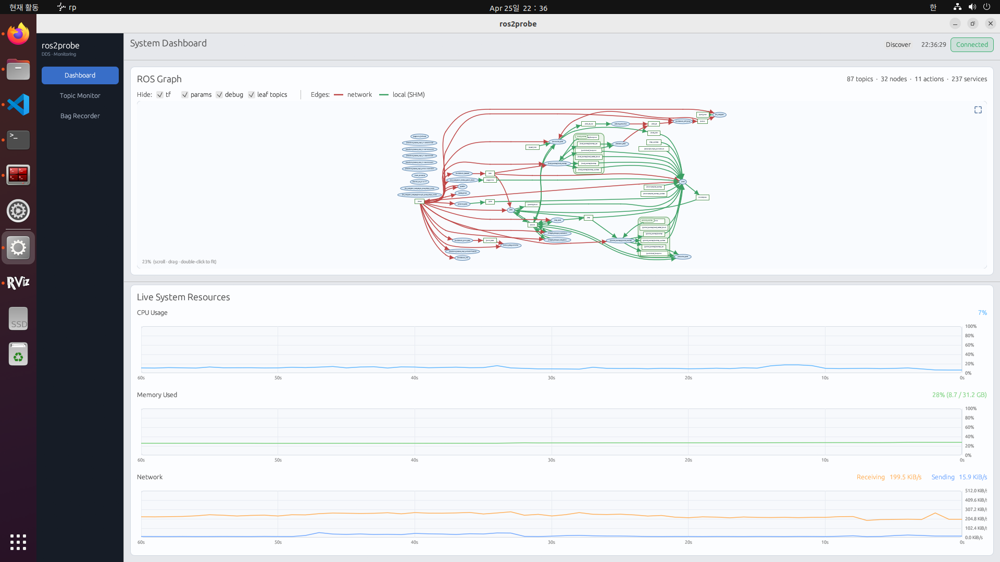

# ros2probe

[](https://github.com/csi-dgist/ros2probe/releases/latest)
[](LICENSE)
[](https://arxiv.org/abs/2606.10746)

Host-level observability for ROS 2 DDS traffic — without creating ROS 2 subscriptions.

ros2probe attaches an eBPF socket filter to every non-loopback network interface, captures RTPS/DDS packets in the kernel, and reconstructs the full ROS graph, topic metrics, and message streams entirely in userspace. A CLI (`rp`) and a desktop GUI (`rp gui`) talk to the runtime over a Unix socket. DDS middleware only; Zenoh support is planned.

**Website:** https://csi-dgist.github.io/ros2probe-page/



*More screenshots and live video demos are on the [project page](https://csi-dgist.github.io/ros2probe-page/).*

## Features

- **Zero ROS subscriptions** — traffic is observed passively at the socket level; ros2probe never joins the DDS graph
- **Full graph reconstruction** — participants, endpoints, node names, and publisher/subscriber relationships derived from SPDP/SEDP + `ros_discovery_info`
- **SHM vs network distinction** — topics communicated exclusively over shared memory (FastDDS/CycloneDDS SHM locators) are identified and excluded from recording
- **Live topic metrics** — publish rate (hz), bandwidth (bw), end-to-end delay, and message echo with sliding-window statistics
- **MCAP recording** — bag files with optional zstd/lz4 compression, pause/resume, and topic selection
- **CLI + GUI** — the same data exposed through both interfaces

## Install

No Rust, no compiler, no build dependencies — just download and run. The script detects your architecture and installs `rp` to `/usr/local/bin`.

**CLI only** (default)

```sh
curl -fsSL https://github.com/csi-dgist/ros2probe/releases/latest/download/install.sh | sh
```

**CLI + GUI** (x86-64 only)

```sh
curl -fsSL https://github.com/csi-dgist/ros2probe/releases/latest/download/install.sh | sh -s -- --gui
```

Prebuilt binaries are provided for **x86-64** and **aarch64** (Raspberry Pi 4/5, Jetson); the GUI build is x86-64 only. Uninstall with `sudo rm /usr/local/bin/rp`.

**Requirements**

| Requirement | Notes |
|---|---|
| Linux 5.15+ | eBPF socket filter, AF_PACKET TPACKET_V3 |
| ROS 2 Humble+ | Iron, Jazzy, Rolling also supported |
| Python 3 + `rclpy` | Only for `rp topic echo` |
| Optional | Jumbo frames, or a DDS XML profile that avoids IP fragmentation |

## Quick Start

Run a publisher and subscriber on two hosts (or the same host):

```sh
# Host A
ros2 run demo_nodes_cpp talker
# Host B
ros2 run demo_nodes_cpp listener
```

Then observe the traffic with ros2probe on either host:

```sh
rp run                                 # start the runtime (separate terminal)

rp topic list                          # what's on the wire
rp topic hz /chatter                   # live publish rate
rp bag record /chatter -o session.mcap # record to MCAP

rp gui                                 # or explore visually
```

## Commands

Run `rp <command> --help` for the full set of flags and options.

| Command | Description |
|---|---|
| `rp run` | Start the runtime daemon (auto-escalates to root if needed) |
| `rp gui` | Launch the desktop GUI (the runtime must already be running) |
| `rp topic list` | List topics — recordable first, internal topics separated |
| `rp topic info` / `type` / `find` | Endpoints & QoS, type string, or find topics by type |
| `rp topic hz` / `bw` / `delay` | Live publish rate / bandwidth / end-to-end delay with statistics |
| `rp topic echo` | Stream decoded messages (requires Python + `rclpy`) |
| `rp bag record [TOPICS…]` | Record an MCAP bag — `--all`, `-o <file>`, `--compression-format`, pause/resume |
| `rp node list` / `info` | Discovered nodes and their endpoints |
| `rp service list` / `type` / `find` | Service introspection |
| `rp action list` / `info` | Action introspection |
| `rp discover` | Force a `ros_discovery_info` broadcast to refresh a stale graph |

> **Internal topics** (tf, `parameter_events`, `rosout`, debug, and SHM-only topics) produce no output for `hz` / `bw` / `delay` / `echo`, and are never captured by `rp bag` — even with `--all`.

## GUI

`rp gui` opens a desktop app with three pages:

- **Dashboard** — live node/topic counts, system metrics (CPU, memory, network I/O) with history charts, and an interactive ROS graph. Filters for tf, parameter, debug, leaf, and SHM-only topics are on by default.
- **Topic Monitor** — per-topic hz / bw / delay panels with history charts and statistics, plus an echo view of the last 100 decoded messages.
- **Bag Recorder** — multi-topic selection, compression and output options, and live recording status (elapsed time, file size, per-topic message counts) with pause/resume.

## Citation

ros2probe is described in our paper, available on arXiv: <https://arxiv.org/abs/2606.10746>

If you use ros2probe in your research, please cite it:

```bibtex
@misc{yu2026ros2probe,
  title         = {ros2probe: Non-intrusive, Kernel-selective Observability for Robot Operating System 2 Middleware},
  author        = {Jisang Yu and Sanghoon Lee and Yeonwoo Choi and Kyung-Joon Park},
  year          = {2026},
  eprint        = {2606.10746},
  archivePrefix = {arXiv},
  primaryClass  = {cs.RO},
  url           = {https://arxiv.org/abs/2606.10746}
}
```

## License

ros2probe is licensed under the [Apache License 2.0](LICENSE). The eBPF kernel program is dual-licensed [GPL-2.0](LICENSE-GPL2) OR Apache-2.0, so it can declare a GPL-compatible license to the kernel's BPF verifier.

## Contact

ros2probe is developed at the **DGIST CSI Lab**. For design questions, collaboration proposals, or anything about the project or the paper, reach out to:

- Sanghoon Lee — leesh2913@dgist.ac.kr
- Jisang Yu — julienyu@dgist.ac.kr

For reproducible bugs and feature requests, please open a GitHub issue so the discussion stays public.
